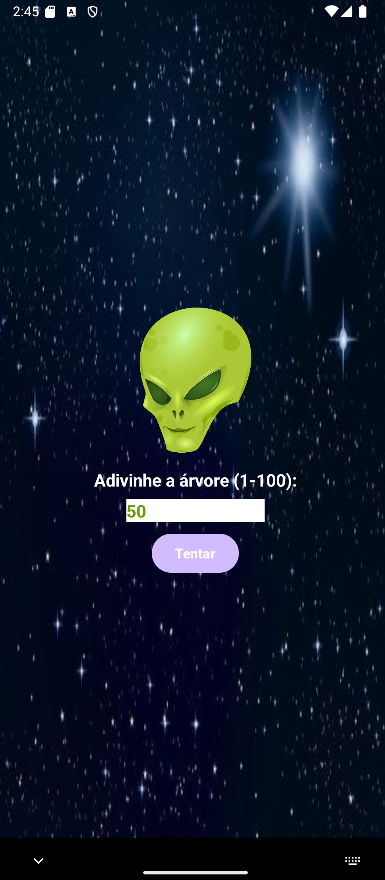
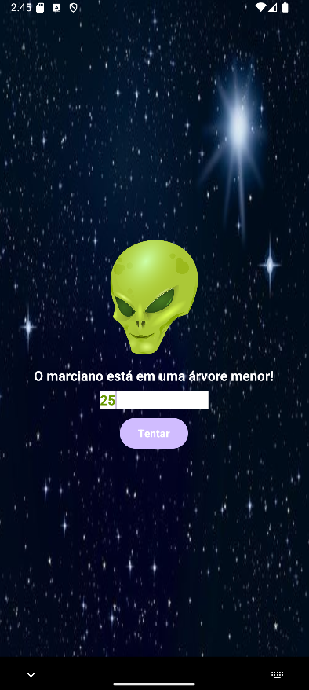
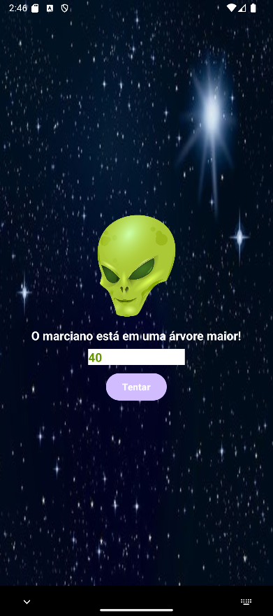
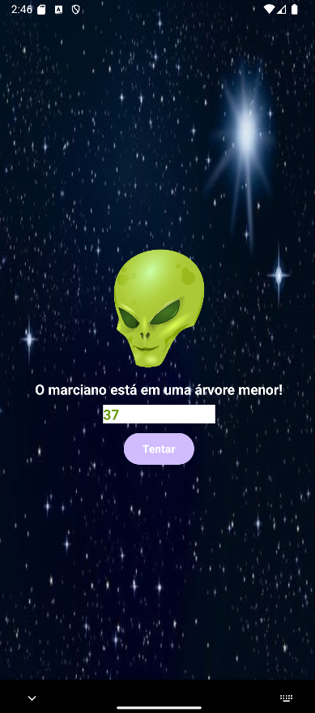
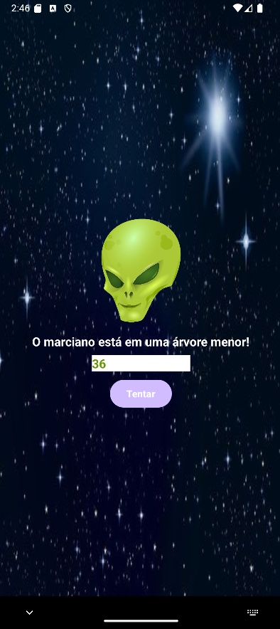
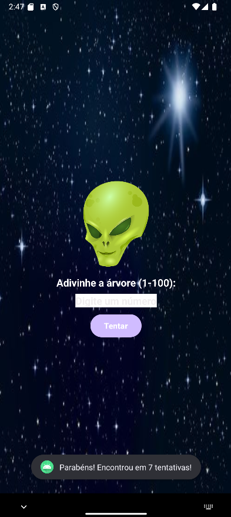

# -Jogo do Marciano
O projeto de um aplicativo móvel para android usando Java, que tem como objetivo um Entretenimento que ajuda a melhorar seu raciocínio e tomada de decisão.

## Descrição
O Jogo do Marciano consiste de uma brincadeira de adivinhação mas ao mesmo tempo um jogo onde busca melhorar seu raciocínio e sua tomada de decisão. O jogador deve descobrir em que árvore o marciano está escondido. Ele deve tentar acertar digitando o número da árvore onde o marciano estaria escondido. Esse número varia de 1 a 100. A cada tentativa, o jogo informa se o marciano está naquela árvore ou em uma árvore de número menor ou maior. Cada tentativa é computada para que no final seja exibido o número total de tentativas até encontrar o marciano.


## Tecnologias usadas

*   
* 


## Instalacao
1. Extensão necessária: https://marketplace.visualstudio.com/items?itemName=vscjava.vscode-java-pack)
<br>

2. clonar o repositório
 ```sh
   [git clone https aqui](https://github.com/Luiz-sassaki/Jogo-do-Marciano.git)
   ```   
4. Agora, compile o código usando o caminho correto:
   ```sh
   javac JogoDoMarciano/JogoDoMarcianoGUI.java
   ```
5. Agora, execute o jogo assim:
   ```sh
   java JogoDoMarciano.JogoDoMarcianoGUI
   ```

   ## Modo de Uso

<B>TELA INICIAL</B><br>


<B>SEGUNDA TENTATIVA</B><br> 


<B>TERCEIRA TENTATIVA</B><br>


<B>QUARTA TENTATIVA</B><br>   


<B>QUINTA TENTATIVA</B><br> 


<B>SEXTA TENTATIVA</B><br> 


<B>SÉTIMA TENTATIVA</B><br> 


<B>ENCONTROU O MARCIANO</B><br> 



## Desenvolvedor

<a href="https://github.com/Luiz-sassaki"/>

</a>

<div> 
Luiz Fellipe Nunes Sassaki - 01608282 <br>
 
</div>
